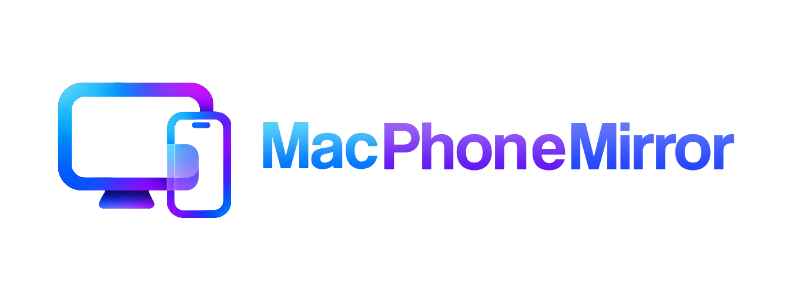

<p align="center">
  
</p>

# MacPhoneMirror

[](https://github.com/enegalan/MacPhoneMirror/actions/workflows/ci.yml)

<p align="center">
  <strong>Mirror your iPhone's screen on your Mac — and control it with your mouse and keyboard.</strong><br/>
  A fast, native macOS app that turns your Mac into a full-size iPhone display you can actually use.
</p>

---

## What you can do

* 📱 **Mirror your iPhone** — See your phone's screen on your Mac, smooth and lag-free.
* 🖱️ **Control it from your Mac** — Use your mouse or trackpad to tap, scroll, and click on your phone.
* ⌨️ **Type with your Mac keyboard** — Type in any iOS app, plus handy shortcuts: `⌘H` for Home, `⌘Tab` for the App Switcher, `⌘Space` for Spotlight, and `Esc` to lock.
* 🎨 **Realistic phone frames** — Your iPhone is framed in a detailed titanium body (Natural, Black, Desert, White, Deep Purple) with an animated Dynamic Island and pressable side buttons.
* 🪟 **One window per phone** — Each connected iPhone gets its own window, so you can mirror several devices at once and even combine them into tabs.
* 🔒 **Private & legit** — Runs entirely on your Mac, uses Apple's official tools, and needs no jailbreak or separate app on your phone.

---

## Getting started

### What you'll need
* macOS 14.0+ (Sonoma) or newer
* An Apple Silicon (M1/M2/M3/M4) or Intel Mac
* An iPhone that supports Screen Mirroring

### Run it
```bash
# Clone the repository
git clone https://github.com/enegalan/MacPhoneMirror.git
cd MacPhoneMirror

# Build and run
swift run MacPhoneMirror
```

Open **Screen Mirroring** on your iPhone and pick your Mac. Your screen will appear in its own window — ready to control right away.

---

## Keyboard shortcuts

| Shortcut | What it does            |
| :------- | :---------------------- |
| `⌘H`     | Go to the home screen   |
| `⌘Tab`   | Open the app switcher   |
| `Esc`    | Lock or wake the iPhone |

---

## How it works

> New to the technical details? You don't need any of this to use the app.

MacPhoneMirror is built on Apple's own screen-sharing and input technologies, so everything stays fast, reliable, and fully private on your machine. If you're curious about the engineering, read [FEASIBILITY.md](FEASIBILITY.md).

---

## License

This project is licensed under the [MIT License](LICENSE).
